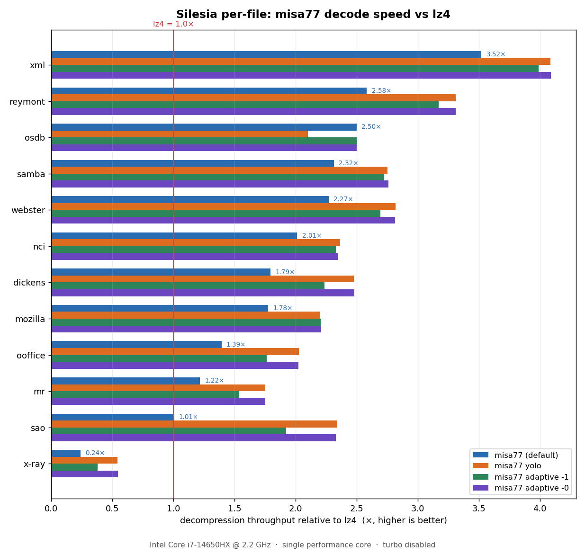
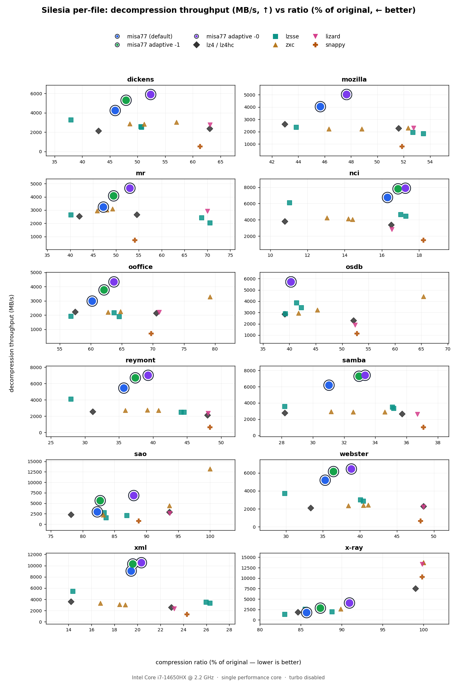

# misa77 (0.1.1)

misa77 is an LZ-based codec that targets the write-once, read-many niche. In particular, it aims to satisfy the following criteria:

- Extremely high decompression throughput (single-threaded).
- Modest compression ratios (it has no entropy backend, so one can obviously not compare it to something like zstd, but LZ4 at high effort levels is a good reference point).
- Constant memory use, regardless of input size (<= 5 MB across all compression modes, and 0 MB for decompression).

Slow compression is the obvious tradeoff that one makes to achieve the above.

In addition, misa77 has a somewhat synergizing tendency to decompress highly compressed files faster, leading to the following results:

- It offers particularly high decompression throughput on highly compressible files.
- Even for moderately compressible files, spending more effort during compression to get a more compressed result leads to better decompression throughput (alongside the natural advantage of better ratios).

This makes high-effort compression particularly attractive for misa77, and inspires some experimental compression modes (refer to [src/experimental/](src/experimental/)) that aim to spend more effort at compression time to produce a compressed stream that is friendlier to the microarchitectures of most CPUs when decompressing said streams. As of v0.1.1, there are two experimental compressors: 

1. `misa77::experimental::adaptive_compress` for homogeneous data. 
2. `misa77::experimental::yolo_compress`, which is more general-purpose and has lesser overhead than (1).

## Documentation

The underlying stream format (used by the library functions) and the container format for `.misa77` files (produced by the CLI) can be found in [`docs/`](docs/).

## Benchmarks

Detailed results are listed ahead, but here's a terse summary:

- misa77 lies on the pareto frontier for decompression throughput vs compression ratio on most shapes of data.
- It very frequently decompresses faster even when competitors have a significantly worse ratio.
- It is quite slow at compression.

Let's first see some less granular cross-platform results on [silesia.tar](https://sun.aei.polsl.pl//~sdeor/corpus/silesia.zip) (the Silesia corpus).

Note:

1. "Ratio" ahead is equal to `((compressed size)/(original)) * 100` (so lower is better).
2. All benchmarks were run using [this fork of lzbench](https://github.com/welcome-to-the-sunny-side/lzbench).

---

### x86-64 (Intel)

Details:

- CPU: Intel(R) Core(TM) i7-14650HX (@2.2 GHz) (Intel Turbo disabled).
- Single threaded, pinned to a single performance core.
- CPU governor set to `performance`.

| Compressor name          | Compression | Decompress. |  Ratio | Filename    |
| ------------------------ | ----------- | ----------- | ------ | ------------|
| misa77 0.1.0             |   43.9 MB/s |   4285 MB/s |  39.62 | silesia.tar |
| misa77 0.1.0 yolo        |   7.68 MB/s |   5513 MB/s |  42.75 | silesia.tar |
| lz4 1.10.0               |    370 MB/s |   2512 MB/s |  47.59 | silesia.tar |
| lz4hc 1.10.0 -12         |   7.31 MB/s |   2534 MB/s |  36.45 | silesia.tar |
| lizard 2.1 -10           |    323 MB/s |   2452 MB/s |  48.79 | silesia.tar |
| lzsse4fast 2019-04-18    |    186 MB/s |   2538 MB/s |  45.26 | silesia.tar |
| lzsse8fast 2019-04-18    |    183 MB/s |   2668 MB/s |  44.80 | silesia.tar |
| zxc 0.12.0 -3            |    115 MB/s |   2839 MB/s |  45.46 | silesia.tar |
| zxc 0.12.0 -4            |   81.0 MB/s |   2727 MB/s |  42.63 | silesia.tar |
| zxc 0.12.0 -5            |   48.7 MB/s |   2599 MB/s |  40.25 | silesia.tar |
| zstd 1.5.7 -1            |    297 MB/s |    902 MB/s |  34.54 | silesia.tar |
| snappy 1.2.2             |    376 MB/s |    857 MB/s |  47.89 | silesia.tar |

### x86-64 (AMD)

Details:

- CPU: AMD Ryzen 7 260 (@3.8 GHz) (Frequency boost disabled).

| Compressor name          | Compression | Decompress. | Ratio | Filename    |
| ------------------------ | ----------- | ----------- | ----- | ----------- |
| misa77 0.1.0             |   71.3 MB/s |   6220 MB/s | 39.62 | silesia.tar |
| misa77 0.1.0 yolo        |   13.7 MB/s |   7832 MB/s | 42.75 | silesia.tar |
| lz4hc 1.10.0 -12         |   12.8 MB/s |   4326 MB/s | 36.45 | silesia.tar |
| lz4 1.10.0               |    693 MB/s |   4455 MB/s | 47.59 | silesia.tar |
| lizard 2.1 -10           |    573 MB/s |   2887 MB/s | 48.78 | silesia.tar |
| lzsse4fast 2019-04-18    |    323 MB/s |   4195 MB/s | 45.26 | silesia.tar |
| lzsse8fast 2019-04-18    |    311 MB/s |   4416 MB/s | 44.80 | silesia.tar |
| zxc 0.12.0 -3            |    213 MB/s |   4935 MB/s | 45.99 | silesia.tar |
| zxc 0.12.0 -4            |    151 MB/s |   4776 MB/s | 43.04 | silesia.tar |
| zxc 0.12.0 -5            |   87.3 MB/s |   4570 MB/s | 40.29 | silesia.tar |
| zstd 1.5.7 -1            |    491 MB/s |   1598 MB/s | 34.55 | silesia.tar |
| snappy 1.2.2             |    691 MB/s |   1355 MB/s | 47.85 | silesia.tar |

### ARM64 (Apple Silicon)

Details: 

- CPU: Apple M3

| Compressor name          | Compression | Decompress. | Ratio | Filename    |
| ------------------------ | ----------- | ----------- | ----- | ----------- |
| misa77 0.1.0             |   94.3 MB/s |  10007 MB/s | 39.62 | silesia.tar |
| misa77 0.1.0 yolo        |   17.1 MB/s |  13088 MB/s | 42.75 | silesia.tar |
| lz4 1.10.0               |    881 MB/s |   5173 MB/s | 47.59 | silesia.tar |
| lz4hc 1.10.0 -12         |   17.0 MB/s |   4874 MB/s | 36.45 | silesia.tar |
| zxc 0.12.0 -3            |    276 MB/s |   8010 MB/s | 45.77 | silesia.tar |
| zxc 0.12.0 -4            |    192 MB/s |   7628 MB/s | 43.20 | silesia.tar |
| zxc 0.12.0 -5            |    114 MB/s |   7126 MB/s | 40.30 | silesia.tar |
| snappy 1.2.2             |    966 MB/s |   3438 MB/s | 47.91 | silesia.tar |
| zstd 1.5.7 -1            |    714 MB/s |   1614 MB/s | 34.54 | silesia.tar |
| lizard 2.1 -10           |    830 MB/s |   6530 MB/s | 48.78 | silesia.tar |

Note: There are no explicit intrinsics for NEON yet, and while I've intentionally kept the hot loops simple enough for compilers to easily vectorize, an evil compiler can still destroy performance on non-x86 targets by choosing not to vectorize.

---

As misa77's performance is quite "spiky" (depending on the shape of the data being compressed), a file-level breakdown for the silesia corpus yields some interesting insights into its performance. 

Note: 

- The visuals that follow are derived from the benchmark results at [misc/lzbench-results-archive/0.1.0/intel.txt](misc/lzbench-results-archive/0.1.0/intel.txt)
- These results are with the same x86-64 (Intel) setup mentioned previously.

### Decode speed relative to lz4

Every misa77 mode decodes faster than lz4 on 11 of the 12 files (some by huge margins). The exception is `x-ray`, which is highly incompressible (lz4 has a ratio of nearly 1.0 on this file and essentially devolves to a `memcpy`).



### Throughput vs ratio, against popular fast-decode codecs

On the compressible files, misa77 sits on the decode-throughput/ratio Pareto frontier: it decodes fastest while ~matching or beating the ratio of the other fast-LZ codecs. `sao` and `x-ray` are exceptions due to the reasons stated before.



## Requirements

- A C++20 compiler (both GCC and Clang are fine).
- CMake >= 3.20.
- A little-endian 64-bit system.
- The `misa` CLI needs POSIX (Linux, macOS).

Note: On x86-64, AVX2/SSE2 are selected at runtime. Other architectures use a portable path that has no explicit intrinsics, but is easily auto-vectorizable by compilers (and from my testing, does auto-vectorize on Apple ARM at the very least).

## Building

```sh
cmake -B build -DCMAKE_BUILD_TYPE=Release
cmake --build build
```

This produces the `misa` CLI at `build/misa`. For a binary tuned to the exact machine you'll run it on, add `-DMISA77_MARCH=native` (I recommend this). To run the round-trip test:

```sh
ctest --test-dir build
```

## CLI Usage

`misa` is a single, dependency-free binary with three file-based subcommands. It operates on single files only (there's no directory or pipe support, so `tar` first if you need those).

```sh
misa compress   FILE          # -> FILE.misa77
misa decompress FILE.misa77   # -> FILE
misa suggest    FILE          # -> FILE.misap  (tuned params)
```

The compression modes (compress-only, at most one at a time):

| Flag | Effect |
| ---- | ------ |
| *(none)* | the fast default compressor |
| `--yolo` | high-effort, decode-optimized; general-purpose |
| `--adaptive` | autotune the compressor based on the input for decode speed (only use this with homogeneous data) |
| `--params F.misap` | compress with a vector from `misa suggest` |

`--adaptive` and `suggest` also take `--tight` / `--loose` (the ratio-vs-decode dial, default loose) and `--sample MB` (how much input to sample when picking params, default 2). Everywhere, `-o PATH` sets the output path and `-f` overwrites without asking.

```sh
misa compress --yolo enwik8              # enwik8 -> enwik8.misa77
misa decompress enwik8.misa77            # back to enwik8

# tune on a sample, then reuse the params:
misa suggest --tight data.bin            # -> data.misap
misa compress --params data.misap data.bin
```

## Status

1. misa77's format may change unexpectedly as it's still v0.x.y. 
2. The decoder assumes that the input is a valid misa77 stream. Invalid input is UB and I offer no guarantees for whatever misa77 does in this case.
3. It's been through some local fuzzing but is not hardened, so treat it as experimental.

Note: misa77 has evolved out of a less polished endeavour to learn performance engineering, and its history can be found [in this archived repository](https://github.com/welcome-to-the-sunny-side/misa77-archive).

## Acknowledgement

Inspiration has been taken from:

- [LZ4](http://github.com/lz4/lz4/)
- [zxc](https://github.com/hellobertrand/zxc)
- [lizard](https://github.com/inikep/lizard)

Lastly, Claude Opus 4.8 helped a lot with scripting, tooling, and building the CLI.

## License

MIT (see [LICENSE](LICENSE)).